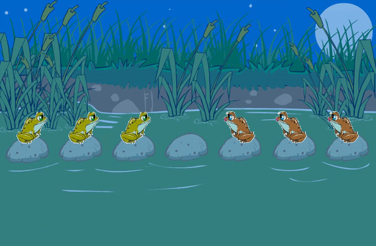
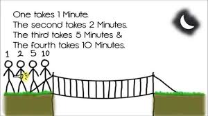

# State Space Search
### - This repo consists of the state space search based questions:

    1. Rabbits Jumping to Opposite side without falling in water

    2. Crossing the bridge within 1 hour when it's Raining

---
---

## Question 1 (Rabbit Leap Problem):
```In the rabbit leap problem, three east-bound rabbits stand in a line blocked by three west-bound rabbits. They are crossing a stream with stones placed in the east west direction in a line. There is one empty stone between them.```
    

```FIGURE 1.0 Rabbits waiting to cross. Each rabbit can jump over one, but not more than that. How can they avoid getting into a deadlock?```

```The rabbits can only move forward one step or two steps. They can jump over one rabbit if the need arises, but not more than that. Are they smart enough to cross each other without having to step into the water? Draw the state space for solving the problem, and find the solution path in the state space graph.```

---

## ***Approach***
### 1. **Represent State**:
>Use a notation like `(R and L and _ )` to represent the positions of the rabbits and the empty space. For example, `RRR_LLL` where  **_** is the empty space.

### 2. **Identify Goal**:
>Determine the final Goal like `LLL_RRR`, If `RRR_LLL` is the initial State and implement the ***goalTest()*** function.

### 3. **Generate all valid Children**:
>From each State Generate all possible valid Children like try to move every rabbit from it's position to all valid moves 

``` for example if the State is ['R','R','R','_','L','L','L']:```

``` Then all valid moves are: ```
```
['R', '_', 'R', 'R', 'L', 'L', 'L']
['R', 'R', '_', 'R', 'L', 'L', 'L']
['R', 'R', 'R', 'L', '_', 'L', 'L']
['R', 'R', 'R', 'L', 'L', '_', 'L']
```

### 4. **Perform BFS or DFS to reach Goal**:
>Take two List `OPEN` and `CLOSED` and push the start into `OPEN` and pop the element from `OPEN` and push it into `CLOSED` and check `goalTest()` and generate all Child of poped elements and push back into OPEN(BFS) / front into OPEN(dfs) and repeat until `OPEN` is not empty 

### 5. **Print Path**:
> If `goalTest()` return true reconstruct the path by backtracking it's parent in the `CLOSED`

---
---


## Question 2 (Bridge Over River):
```Amogh, Ameya and their grandparents have to cross a bridge over the river within one hour to catch a train. It is raining and they have only one umbrella which can be shared by two people. Assuming that no one wants to get wet, how can they get across in an hour or less? Amogh can cross the bridge in 5 minutes, Ameya in 10, their grandmother in 20, and their grandfather in 25. Design a search algorithm to answer the question.```
    

---

## ***Approach***
### 1. **Represent State**:
>Use a notation like `(0 and 1)` to represent the positions of the people either crossed bridge or not and time requied to cross and time taken so far and the position of the torch/umberalla. For example:

    position -> [1,0,0,0]
    time requied -> [5,10,20,25]
    time taken so far -> 5
    umberalla side -> 1

### 2. **Identify Goal**:
>Determine the final Goal like `[1111]`, If `[0000]` is the initial State and implement the ***goalTest()*** function.

### 3. **Generate all valid Children**:
>From each State Generate all possible valid Children like try to move every rabbit from it's position to all valid moves 

``` for example if the State is [0,0,0,0],[5,10,20,25],0,0:```

``` Then all valid moves are: ```
```
[1000], 5
[1100], 10
[1010], 20
[1001], 25
[0100], 10
[0110], 20
[0101], 25
[0010], 20
[0011], 25
[0001], 25
```

### 4. **Perform BFS or DFS to reach Goal**:
>Take two List `OPEN` and `CLOSED` and push the start into `OPEN` and pop the element from `OPEN` and push it into `CLOSED` and check `goalTest()` and generate all Child of poped elements and push back into OPEN(BFS) / front into OPEN(dfs) and repeat until `OPEN` is not empty 

### 5. **Print Path**:
> If `goalTest()` return true reconstruct the path by backtracking it's parent in the `CLOSED`

---
---

## Conculsion
    This repository contains the complete solutions of both the questions. 
    If you have any questions feel free to open a issue.

---
    Thank you for Visitng!


📧 **Email**: badamvenkatesh2007@gmail.com  
🔗 **LinkedIn**: [Badam Venkatesh](https://linkedin.com/in/badamvenkatesh)  
💻 **GitHub**: [Venkatesh2007](https://github.com/Venkatesh2007)


